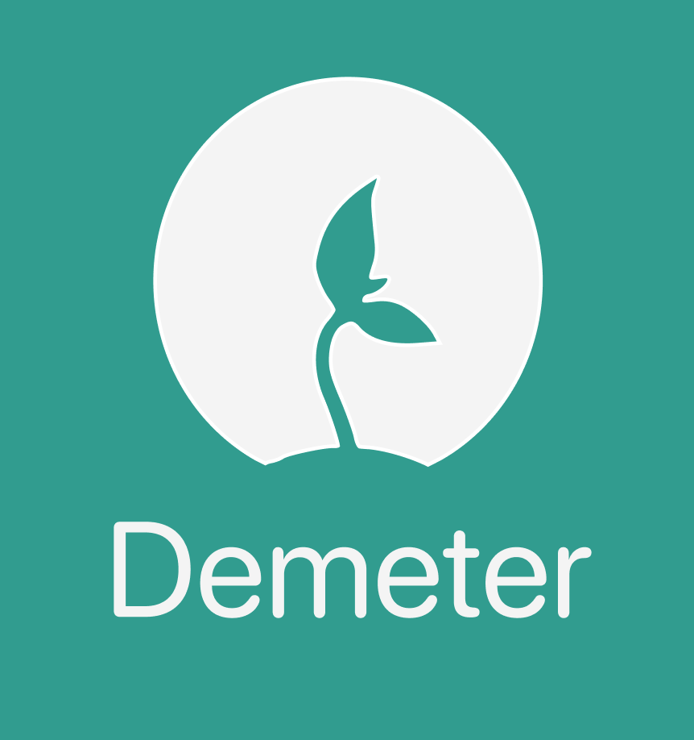
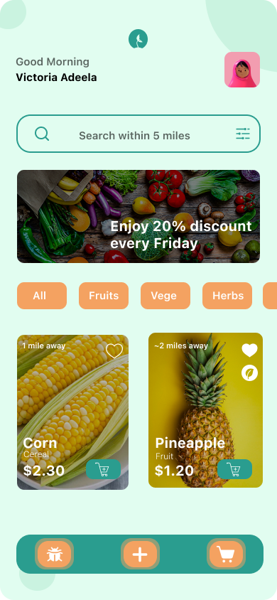
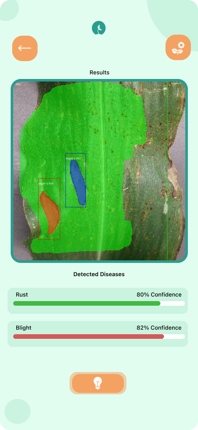

A mobile app that promote a sustainable marketplace for farmers to connect with consumers

<!-- ABOUT THE PROJECT -->

## About The Project

  
  

 
 

**Problems**:

- Farmers have revenue losses and connections with consumers due to Covid-19.

- Consumers have trouble accessing organic food direct from farmers leading to food waste.

- Farmers have problems in dealing with diseases and access to efficient practices.

**Our Solution**:
 

- An online market where consumers could search for local crops in their areas and be connected to farmers who are selling the matching products.

- A convenient place for farmers to manage their crops out of diseases and access to sustainable solutions and experts

### Built With

- **Frontend**: Swifts for iOS app development

- **Backend**: Firebase Firestore and Firebase Realtime database for data storage, Firebase Storage for images (crops, detected results) storage
- **Technologies**: Google Pay for app payment
- **Programming Languages**: Swift, Python
- **Tools**: Xcode, Google Colab Pro for Training Tensorflow Model, Google Cloud Run to host Tensorflow Model in Docker Container

<!-- GETTING STARTED -->

## Getting Started

Please make sure you have Xcode installed. Version 13 was used for this project.

### Prerequisites

This is an example of how to list things you need to use the software.

- Xcode >12
- IPhone 13 Pro Simulator with IOS 15 (preferred)

### Installation

Download the project and open Demeter.xcodeproj
  

(<a href="#top">back to top</a>)

### Test Example of Model
  Google Colab Notebook: ``https://colab.research.google.com/drive/1Xuj2irtug69g-8f9lOU3aOVRYJXRNCJX?usp=sharing``

<!-- ROADMAP -->
## Roadmap

- [x] Add Demo frontend
- [x] Google Solutions Submissions
- [x] Train ML model using Google Colab
- [ ] Deploy ML model to Cloud Run
- [ ] Set up backend Firebase Firestore, Storage
- [ ] Publish on App Store

(<a href="#top">back to top</a>)

<!-- CONTRIBUTING -->
## Contributing

Contributions to this project will open soon after the Competition (Sepetember, 2022). Thank you!

(<a href="#top">back to top</a>)

<!-- CONTACT -->
## Contact

Stephane Le - ``stephaniele20@augustana.edu`` 

Hung Tran - ``hungtran20@augustana.edu ``

Paul Addai - ``pauladdai19@augustana.edu``

Rijan Kafle - ``rijankafle20@augustana.edu ``

Project Link: [https://github.com/tthuwng/demeter.git](https://github.com/tthuwng/demeter.git)

(<a href="#top">back to top</a>)

<!-- ACKNOWLEDGMENTS -->
## Acknowledgments

This projects is for Google Solutions Challenge 2022

